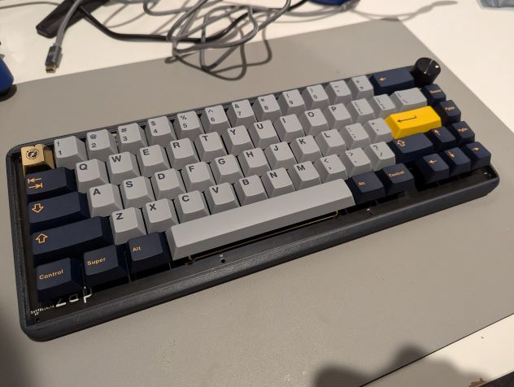
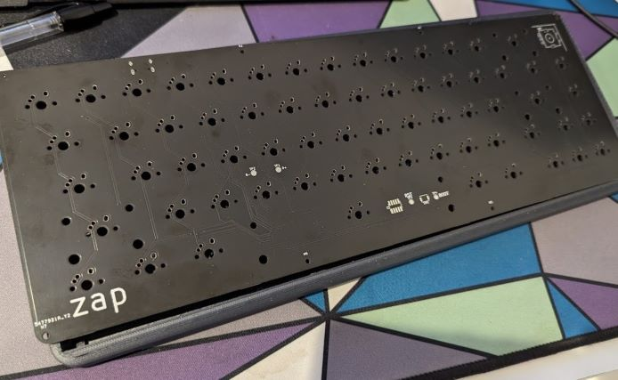
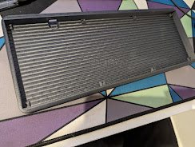

# keeb-dreaming
Build a 68% keyboard pcb and case

Assembled keyboard (bought the caps and switches):

## Features
- USB-C
- Volume knob + mute button
- Compression fit of pcb with case, no fasteners needed

## PCB

- Learned from https://wiki.ai03.com/books/pcb-design/chapter/pcb-designer-guide
- Use KiCAD to edit the schematics and pcb design

## Firmware
- Copy [this folder](qmk/zap) into the [QMK repository's keyboards folder](https://github.com/qmk/qmk_firmware/tree/master/keyboards)
- Use the [QMK MSYS terminal tool](https://docs.qmk.fm/#/newbs_getting_started) and run `qmk compile -kb zap -km default`
- Alternatively, if you have a c compiler and make installed, run `make zap`
#### Flashing
- `make zap:default:flash`
- If that does not work try power cycling/resetting while shorting the BOOT0 pin to ground (exposed on the PCB, feel free to solder a switch on it).
- Use the [STM32 programmer](https://www.st.com/en/development-tools/stm32cubeprog.html) for further debugging and validating.

## Case

- In the picture above is this [case](case/3d), 3D printed, modeled using SolidWorks (free-trial)
- A layered version is also in the [case/layered](case/layered) folder

### Note
- The tolerance of the case is very small with the PCB, super tight fitting. Probably because 3D prints expand. Adjust the sizing of either the case or the PCB, and use M2 screws to fasten if needed.
- The USB-C hole needs to be higher/taller, make sure to edit it to leave at most 10mm material from the edge. The one in the picture had its hole expanded post production.
- Adding to the point above, foam can be added below but may change the placing of the USB-C hole.
